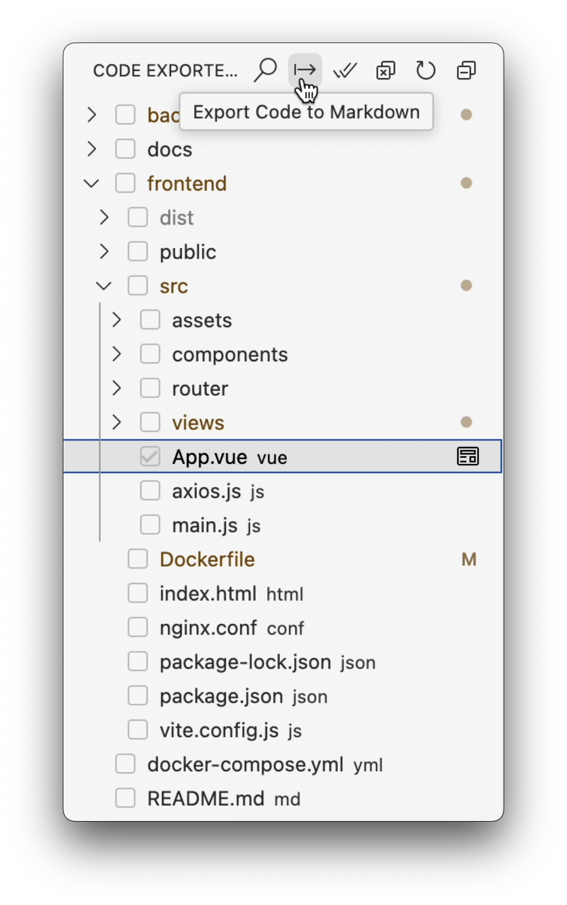

# Code Exporter

A Visual Studio Code extension that helps you export selected files and directories to a Markdown document, complete with directory structure visualization and syntax-highlighted code blocks.

## Features

- 📝 Export code with syntax highlighting
- 📂 Generates directory tree structure
- 🔍 File search by pattern (e.g. `*.py`)

## Usage

1. Click the Code Exporter icon in the Activity Bar (left sidebar).
2. Select files or directories to export by clicking them in the tree view:
   - Toggle selection by clicking a file/directory.
   - Use the “Search & Select Files” command to filter files by pattern (e.g. `*.ts`).
   - Use “Select All” / “Deselect All” buttons to manage selections swiftly.
3. Click the "Export Code to Markdown" button (or run the command from the Command Palette).
4. Choose where to save the exported Markdown file.
5. Open the generated Markdown file to view your exported code.



## Extension Settings

This extension provides the following settings:

* `codeExporter.outputPath`: Default path for exported Markdown files.
* `codeExporter.includeHidden`: Include hidden files in the tree view.
* `codeExporter.excludePattern`: Glob pattern for files to exclude (default: **/node_modules/**,**/.git/**).
* `codeExporter.defaultLanguageMap`: Map file extensions to Markdown language identifiers. Default mappings:
  ```json
  {
    ".ts": "typescript",
    ".js": "javascript",
    ".py": "python",
    ".java": "java",
    ".cpp": "cpp",
    ".c": "c",
    ".html": "html",
    ".css": "css",
    ".json": "json",
    ".md": "markdown",
    ".sh": "bash"
  }
  ```
* `codeExporter.searchPattern`: Current search pattern for filtering files.
* `codeExporter.useRegex`: Use regular expressions for search.

## Available Commands

- **Code Exporter: Search & Select Files** – Filter files by pattern.
- **Code Exporter: Export Code to Markdown** – Export selected files to a Markdown document.
- **Code Exporter: Refresh File Tree** – Refresh the file tree view.
- **Code Exporter: Select All** – Select all files in the tree.
- **Code Exporter: Deselect All** – Deselect all files.
- **Code Exporter: Preview File** – Open a file preview in VS Code.
- **Code Exporter: Show in File Explorer** – Reveal the file in the OS file explorer.
- **Code Exporter: Copy Absolute Path** – Copy the file's absolute path.
- **Code Exporter: Copy Relative Path** – Copy the file's path relative to the workspace.

## Requirements

* Visual Studio Code version 1.96.0 or above.

## Extension Development

1. Clone the repository.
2. Run `npm install`.
3. Press F5 to launch the "Extension Development Host".
4. Test the extension in the Extension Development Host window.
